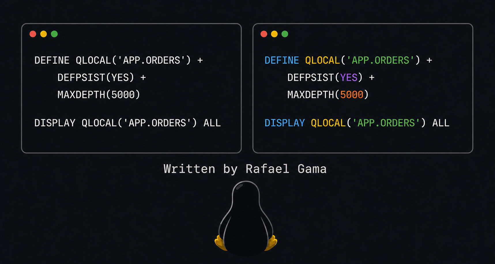

# nvim-mqsc-syntax



Syntax highlighting for **IBM MQ Script Commands (MQSC)** files in Neovim.

The plugin recognizes files with the `.mqsc` extension and highlights
commands, object types, attributes, strings, numbers, constant values, and
comments commonly used when administering IBM MQ.

> This project provides syntax highlighting. It is not a language server and
> does not validate commands against a queue manager.

## What is MQSC?

MQSC is the command language used to administer IBM MQ objects such as queues,
channels, listeners, topics, and the queue manager itself. An MQSC file can,
for example, create and inspect a local queue:

```mqsc
* Application order queue
DEFINE QLOCAL('APP.ORDERS') +
  DESCR('Order queue') +
  DEFPSIST(YES) +
  MAXDEPTH(5000)

DISPLAY QLOCAL('APP.ORDERS') ALL
```

MQSC files are commonly executed with `runmqsc`:

```sh
runmqsc QUEUE_MANAGER_NAME < commands.mqsc
```

Always confirm the target queue manager before running commands that change or
delete objects.

## How it works

Neovim loads two main components from this plugin:

1. `ftdetect/mqsc.lua` associates the `.mqsc` extension with the `mqsc`
   filetype.
2. `syntax/mqsc.vim` defines the syntax groups and matching rules.

The plugin does not enforce a fixed color palette. Each MQSC syntax group is
linked to a standard Neovim highlight group, allowing your colorscheme to
choose the final colors.

## Requirements

- Neovim with `vim.filetype.add` support; Neovim 0.8 or newer is recommended.
- Syntax highlighting enabled with `:syntax enable`.

## Installation

### lazy.nvim

After publishing this repository, replace `YOUR-USERNAME` with your GitHub
username:

```lua
{
  "YOUR-USERNAME/nvim-mqsc-syntax",
  ft = "mqsc",
}
```

Run `:Lazy sync`, then reopen an `.mqsc` file.

### packer.nvim

```lua
use("YOUR-USERNAME/nvim-mqsc-syntax")
```

Then run `:PackerSync`.

### vim-plug

```vim
Plug 'YOUR-USERNAME/nvim-mqsc-syntax'
```

Then run `:PlugInstall`.

### Manual installation

Clone the project into a directory on Neovim's `packpath`:

```sh
git clone https://github.com/YOUR-USERNAME/nvim-mqsc-syntax.git \
  ~/.local/share/nvim/site/pack/plugins/start/nvim-mqsc-syntax
```

Alternatively, copy the files directly into your Neovim configuration:

```sh
mkdir -p ~/.config/nvim/ftdetect ~/.config/nvim/syntax
cp ftdetect/mqsc.lua ~/.config/nvim/ftdetect/mqsc.lua
cp syntax/mqsc.vim ~/.config/nvim/syntax/mqsc.vim
```

## Verification

Open the example included in this project:

```sh
nvim examples/example.mqsc
```

Check the detected filetype inside Neovim:

```vim
:set filetype?
```

The expected result is:

```text
filetype=mqsc
```

Use the following command to inspect the highlight group under the cursor:

```vim
:Inspect
```

If the filetype is correct but no colors are shown, run:

```vim
:syntax enable
```

## Project structure

```text
nvim-mqsc-syntax/
├── assets/
│   └── tux-mqsc-neovim.png  # README banner
├── examples/
│   └── example.mqsc          # Demonstration and test file
├── ftdetect/
│   └── mqsc.lua              # Detects .mqsc files
├── syntax/
│   └── mqsc.vim              # Highlight groups and matching rules
├── LICENSE
└── README.md
```

## Customization

You can override any group after loading your colorscheme:

```lua
vim.api.nvim_set_hl(0, "mqscCommand", { fg = "#89b4fa", bold = true })
vim.api.nvim_set_hl(0, "mqscObject", { fg = "#f9e2af" })
```

Available groups:

- `mqscComment`
- `mqscCommand`
- `mqscObject`
- `mqscAttribute`
- `mqscType`
- `mqscBoolean`
- `mqscConstant`
- `mqscString`
- `mqscNumber`
- `mqscContinuation`
- `mqscDelimiter`

## Limitations

- Highlighting is lexical: it recognizes words and patterns but does not check
  whether an attribute is valid for a particular command or object type.
- The plugin does not provide completion, hover information, navigation,
  formatting, or LSP diagnostics.
- MQSC is extensive; words that are not listed yet may appear without
  specialized highlighting.

Contributions adding commands, attributes, examples, and fixes are welcome.

## Artwork

The README illustration was generated for this project with OpenAI image
generation. Tux is the Linux mascot originally created by Larry Ewing. This
project is not affiliated with or endorsed by IBM, the Neovim project, or the
Linux Foundation.

## License

Distributed under the MIT License. See [LICENSE](LICENSE).
